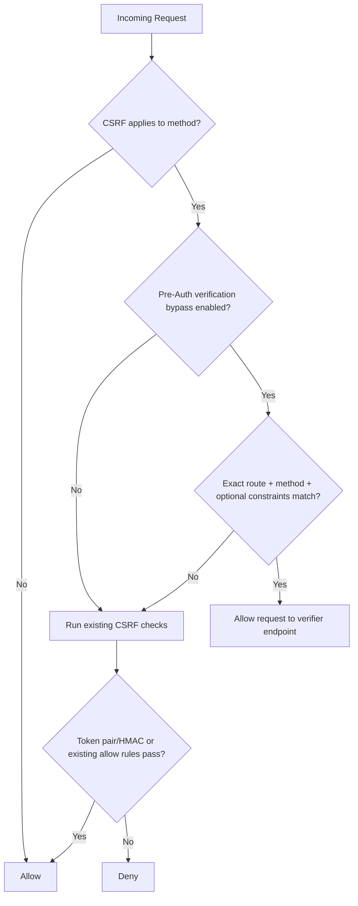

# CSRF Pre-Auth Verification Design (Thorium)

## Purpose
Allow a request to reach an already-implemented token verification endpoint while keeping CSRF protections intact for all normal browser/session mutating routes.

This design document reflects the agreed position that Thorium is introducing a **narrow CSRF policy exception**, not a new verification system and not a general-purpose bypass facility.

## Scope Clarification
- **In scope:** `CSRFGuardModule` policy enhancement only.
- **Out of scope:** building or changing token verification logic itself.
- **Out of scope:** protected API credential lifecycle in Thorium.
- **Out of scope:** a generic CSRF exemption framework for unrelated endpoints.
- **Out of scope:** anomaly detection, bot detection, rate limiting, blacklisting, or abuse-response logic inside `CSRFGuardModule`.

## Implementation Status

- **Completed:** scope lock, config contract, core CSRF bypass logic, and active regression coverage.
- **Completed:** observability and auditability through structured-style logging.
- **Pending:** controlled rollout and later reassessment/refinement.

## Design Intent
CSRF should remain the default protection model. A pre-auth verification request is allowed only when Thorium is explicitly configured that an external verification mechanism exists and the request matches strict bypass rules.

## Preferred Practical Approach

For Thorium version 1, the preferred implementation is:

- fail-closed,
- config-gated,
- exact-route scoped,
- exact-method scoped,
- minimally configurable,
- observable and regression-tested.

This is preferred over `Origin`-based trust, broad path-prefix exemptions, or a larger abstraction introduced prematurely.

It is also preferred over embedding broader abuse-detection or bot-detection concerns directly into `CSRFGuardModule`.

## Core Mechanism (Config-Gated CSRF Pre-Auth Verification Bypass)
Add a narrow bypass decision in `src/main/scala/com/greenfossil/thorium/decorators/CSRFGuardModule.scala`:

- `preAuthVerificationBypass.enabled` is `true` in config.
- Request matches configured verification route(s) exactly.
- Request method matches configured method set exactly (typically `POST`).
- Optional secondary constraints match (headers/content-type) when configured.
- If a required content type is configured, Thorium compares the request media type case-insensitively and also accepts parameterized forms such as `application/json; charset=UTF-8`.

If all conditions match, CSRF allows the request to proceed to the existing verifier endpoint. Otherwise, current CSRF behavior remains unchanged.

## Implemented Runtime Behavior

The current implementation is intentionally narrow:

- bypass defaults to disabled via `reference.conf`,
- matching is exact-path and exact-method,
- required headers are presence checks only,
- required content types are request-shape checks only,
- non-matching requests immediately fall back to existing CSRF behavior,
- same-origin allowances and the existing whitelist logic are otherwise untouched.

More explicitly:

- if `allowPaths` is empty, no request can satisfy the bypass path check, so the feature remains effectively inert even when `enabled = true`,
- if `requiredHeaders` is empty, Thorium applies no header-presence restriction beyond the path and method match,
- if `requiredContentTypes` is empty, Thorium applies no content-type restriction beyond the path and method match,
- if `requiredContentTypes` is non-empty and the request has no `Content-Type`, the bypass does not match and the request falls back to the normal CSRF flow.

In other words, if `requiredHeaders` contains names such as `X-Verify-Channel` or `X-Correlation-Id`, Thorium only checks that those headers exist on the request. Thorium does not interpret their values, does not authenticate callers with them, and does not treat them as a primary trust boundary.

Likewise, if one of those required headers is missing, Thorium should only conclude that the request does **not** match the configured bypass shape. That fail-closed result does not, by itself, prove the caller is malicious; it may also reflect a misconfigured client, gateway, or deployment path.

## Version 1 Must-Do Constraints

- Use precise naming: `preAuthVerificationBypass`.
- Keep the feature disabled by default.
- Prefer exact path matching over prefixes or broad patterns.
- Limit methods to the minimum needed.
- Keep all non-matching requests on the existing CSRF path.
- Log bypass decisions clearly enough for review and troubleshooting.
- Add regression coverage for both positive and negative decision paths.

## Explicitly Deferred

The following improvements may be considered later, but are not required for the first Thorium implementation:

- route annotation or tag-based classification,
- stronger route identity binding beyond path-based config,
- broader endpoint security policy abstractions,
- generic CSRF exemption mechanisms.
- anomaly detection and abuse-control decorators for unusually frequent or suspicious pre-auth verification traffic.

## Why This Is Preferable
- Does not trust `Origin` for internet clients.
- Avoids broad whitelist/prefix exceptions.
- Keeps change localized to CSRF policy logic.
- Fails closed when config is absent or invalid.
- Keeps Thorium focused on what it should own: CSRF policy, not verifier implementation.
- Is easier to set up and maintain than a more abstract policy framework in version 1.
- Preserves separation of concerns so future abuse detection can be added as a dedicated decorator/module rather than overloading CSRF responsibilities.

## Decision Flow


## Proposed Config Shape
```hocon
app.http.csrf.preAuthVerificationBypass {
  enabled = false
  allowPaths = ["/auth/verify-token"]
  allowMethods = ["POST"]
  requiredContentTypes = ["application/json"]
  requiredHeaders = ["X-Verify-Channel", "X-Correlation-Id"]
}
```

Notes:
- Keep `enabled = false` by default.
- Prefer exact paths over broad prefixes.
- Optional constraints should be truly optional, supplemental, and fail-closed when declared.
- Prefer `preAuthVerificationBypass` over generic names such as `preAuthBypass`.
- Do not treat required headers or content types as primary trust anchors; they are request-shape constraints, not proof of legitimacy.

### Example header intent

If a team chooses to use the example headers shown above, the intended meaning is:

- `X-Verify-Channel`: an application-defined label describing which verification flow or client channel is calling the endpoint.
- `X-Correlation-Id`: an application or infrastructure trace identifier used to correlate logs across systems for a single request journey.

These headers are helpful because they make bypass-eligible traffic easier to identify operationally, but they are still only supplemental constraints in Thorium.

Recommended interpretation:

- require `X-Verify-Channel` when you want the request shape to explicitly identify the expected verification path,
- require `X-Correlation-Id` when you want every bypass-eligible request to be traceable during rollout and incident review,
- prefer that `X-Correlation-Id` be issued, normalized, or overwritten by a trusted gateway, ingress layer, or application boundary when possible,
- do not expect `X-Correlation-Id` to be stable across many different requests from the same client; its value is typically per-request rather than per-client,
- do not rely on arbitrary client-supplied `X-Correlation-Id` values to be globally unique or collision-safe unless some trusted upstream layer governs the scheme,
- do not interpret "issued" here as requiring Thorium to own a persistence layer; correlation IDs are normally generated statelessly per request,
- validate any value-level rules outside Thorium, such as in the verification service, gateway, or application layer.

Recommended operational scheme:

- use a trusted upstream layer to generate or normalize the correlation ID,
- prefer a standard high-entropy format such as UUIDv4 or a trace-ID equivalent,
- keep the concern stateless inside the request path; any storage or indexing belongs to external logging or tracing systems, not to `CSRFGuardModule`,
- treat the value as a tracing handle only,
- use separate controls for caller identity and legitimacy.

## Policy Guardrails
- Bypass is route-scoped and method-scoped.
- No global CSRF disable toggle is introduced.
- Log bypass decisions in a structured form with decision and reason fields.
- Keep existing CSRF logic untouched for all non-bypass requests.
- Do not use this mechanism as a substitute for securing the verification endpoint itself.
- Do not use this mechanism as a substitute for anomaly detection, rate limiting, or other abuse controls.
- Do not assume the presence of `X-Verify-Channel` or `X-Correlation-Id` proves request legitimacy.
- Do not assume the absence of `X-Verify-Channel` or `X-Correlation-Id` proves malicious intent; it only means the request should not receive the bypass.

### Current Logging Shape

The CSRF bypass currently emits a structured-style event message similar to:

- `event=csrf_preauth_verification_bypass`
- `decision=allow|skip`
- `reason=matched|disabled|path-not-allowed:...|method-not-allowed:...|content-type-not-allowed:...|missing-required-headers:...`
- `featureEnabled=true|false`

This is intended to support rollout validation and troubleshooting without changing the functional security model.

### Current Observability Scope

Thorium currently emits structured-style logs for pre-auth verification bypass decisions, and that log-based observability scope is considered complete for the current feature.

Optional counters are intentionally deferred as future work because log collection and analysis are expected to happen outside Thorium, and counters may not be warranted unless a later telemetry consumer or dedicated policing module makes them useful.

## Security and Maintainability Assessment

This approach is considered the preferred practical option for Thorium because it balances:

- **security:** narrow scope, fail-closed behavior, and no broad weakening of CSRF,
- **ease of setup:** small config surface and predictable matching model,
- **maintainability:** simple enough for version 1 without introducing unnecessary framework complexity.

It is still an intentional exception path, so its safety depends on disciplined configuration and the assumption that the target verification endpoint is already properly secured.

## Future Security Extension Direction

If Thorium later needs abuse detection for the pre-auth verification route, the preferred direction is to implement it as a **separate threat-guard or decorator module** in the request-processing pipeline, similar in spirit to other focused modules such as `RecaptchaGuardModule`.

That future module could evaluate signals such as:

- unusually high request frequency,
- repeated invalid request-shape patterns,
- repeated failed verification attempts,
- temporary source quarantine or external blacklist integration.

This future work should remain separate from the CSRF bypass logic so that:

- `CSRFGuardModule` stays narrowly responsible for CSRF policy,
- anomaly detection can evolve independently,
- operational enforcement decisions can be tuned without changing CSRF semantics.

The immediate priority remains making the bypass feature production-ready first.

## Acceptance Criteria
- With bypass disabled, pre-auth verification request is still CSRF-blocked (current behavior).
- With bypass enabled and matching route/method, CSRF allows request to reach verifier endpoint.
- Non-matching mutating routes remain CSRF-enforced.
- Wrong path, wrong method, or declared secondary-constraint mismatch still results in normal CSRF enforcement.
- Existing CSRF regression tests continue to pass.
- Audit logs clearly show bypass decision reason.
- The design remains narrowly scoped and is not expanded into a generic bypass feature in version 1.

## Verification Status

The current implementation is backed by active test coverage for:

- pre-auth verification bypass enabled/disabled behavior,
- wrong path, wrong method, missing header, and content-type mismatch fail-closed cases,
- multipart CSRF pass/fail regressions,
- form-data regression coverage proving the bypass does not leak onto unrelated mutating routes,
- CSRF token generation and HMAC verification API behavior.


