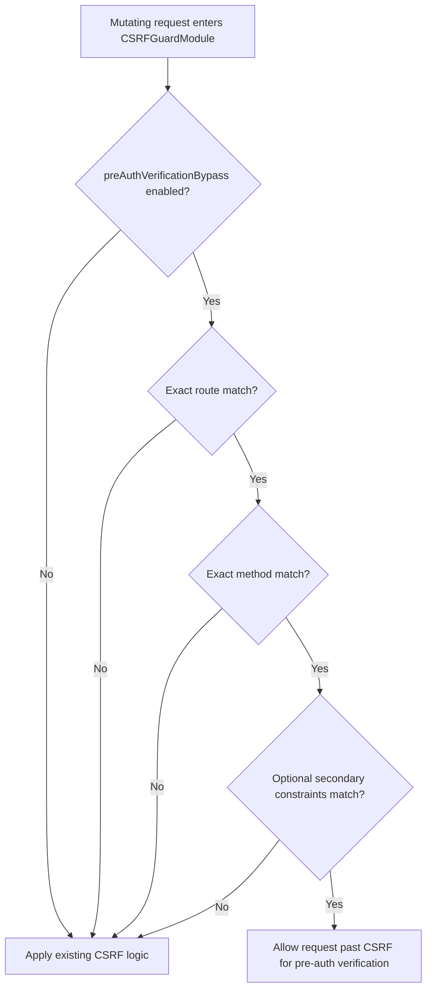

# CSRF Pre-Auth Verification Roadmap (Thorium)

## Objective

Enhance `CSRFGuardModule` so a pre-auth verification request can bypass CSRF **only** when explicitly configured, while leaving all other existing Thorium CSRF behavior unchanged.

This roadmap reflects the agreed position:

- the verifier already exists outside this work,
- Thorium only needs a narrowly scoped CSRF policy enhancement,
- the approach is preferred as a **practical and controlled exception**, not as a general-purpose CSRF bypass framework,
- the first implementation should favor clarity, safety, and maintainability over architectural elegance.

## Implementation Posture

## Current Phase Status

- **Phase 0 - Scope Lock and Security Constraints:** Completed
- **Phase 1 - Config Contract Definition:** Completed
- **Phase 2 - Core CSRF Decision Logic Update:** Completed
- **Phase 3 - Observability and Auditability:** Completed
- **Phase 4 - Test and Regression Coverage:** Completed
- **Phase 5 - Controlled Rollout:** Pending
- **Phase 6 - Reassessment and Optional Refinement:** Pending
- **Future Phase - Anomaly Detection / Abuse Control Module:** Deferred

## Current Delivery Summary

- Thorium now supports a fail-closed `preAuthVerificationBypass` configuration under `app.http.csrf`.
- `CSRFGuardModule` includes the exact-path, exact-method, optional request-shape bypass branch.
- Structured-style decision logging is implemented.
- Active regression coverage exists for pre-auth verification bypass, multipart behavior, and form-data behavior.
- Metrics/counters are intentionally deferred as future optional work, and operational rollout activities remain pending.
- Future anomaly detection is intentionally separated from the CSRF module and reserved for a dedicated decorator/module phase.

### Preferred Practical Approach

Proceed with a **fail-closed, config-gated, exact-route, exact-method** pre-auth verification bypass.

### Must-Do in Version 1

- use precise naming: `preAuthVerificationBypass`,
- keep the feature disabled by default,
- match only explicitly configured route(s),
- restrict to minimal allowed method(s), typically `POST`,
- keep existing CSRF behavior unchanged when no bypass rule matches,
- add explicit logging and regression coverage.

### Explicitly Deferred for Later

- route annotation/tag-based classification,
- broader endpoint security policy framework,
- generalized CSRF exemption system,
- broad prefix matching as the primary model,
- optional counters/metrics for environments that already have a clear external telemetry consumer,
- anomaly detection / abuse-control logic inside `CSRFGuardModule`.

## Delivery Phases

### Phase 0 - Scope Lock and Security Constraints ✅ Completed

- Confirm final scope: CSRF enhancement only.
- Confirm non-goals: no verifier implementation changes, no protected API framework, no generalized exemption system.
- Approve the security position that this is a narrow exception for a pre-auth verification endpoint, not a weakening of Thorium's general CSRF posture.
- Confirm the naming convention: `preAuthVerificationBypass`.

**Exit Criteria**

- Scope and non-goals signed off.
- Naming and terminology agreed.
- Security constraints agreed.

### Phase 1 - Config Contract Definition ✅ Completed

- Define config keys under the CSRF settings, for example `preAuthVerificationBypass.*`.
- Define defaults: bypass disabled unless explicitly enabled.
- Define the first-version matching model:
  - exact path matching,
  - exact method matching,
  - optional secondary constraints such as content-type or required header presence.
- Document that secondary constraints are supplemental guardrails, not primary trust signals.

**Exit Criteria**

- Config schema approved.
- Backward compatibility impact assessed.
- Unsafe patterns explicitly disallowed in docs/config guidance.

### Phase 2 - Core CSRF Decision Logic Update ✅ Completed

- Add a pre-auth verification bypass decision branch in `CSRFGuardModule`.
- Gate the bypass on all required conditions:
  - `enabled = true`,
  - exact route match,
  - exact method match,
  - optional configured secondary constraints.
- Ensure the bypass returns to existing CSRF behavior immediately when the rule does not match.
- Preserve current semantics for assets, non-mutating methods, whitelist behavior, and existing token-pair validation.

**Exit Criteria**

- Deterministic bypass behavior with fail-closed fallback.
- No broadening of CSRF bypass beyond configured pre-auth verification routes.
- Existing CSRF decision paths remain intact.

### Phase 3 - Observability and Auditability ✅ Completed

- Add structured logging for bypass decisions:
  - bypass feature enabled/disabled,
  - exact rule matched/not matched,
  - decision reason,
  - route and method context.
- Make logging explicit enough to support safe rollout and incident review.

**Current Implementation Note**

- Structured-style logging has been implemented for bypass decisions using an event-oriented message format.
- This log-based observability scope is considered sufficient for the current Thorium feature because logs are expected to be gathered and analyzed separately.
- Optional counters/metrics are deferred to future consideration if a real external telemetry consumer or a dedicated policing module later makes them worthwhile.

**Exit Criteria**

- Security and ops teams can trace bypass decisions from logs.
- Misconfiguration is detectable from runtime telemetry.

### Phase 4 - Test and Regression Coverage

✅ Completed

- Add or adjust tests for:
  - bypass disabled -> verify route remains blocked by CSRF,
  - bypass enabled + exact route/method match -> verify route is allowed through CSRF,
  - bypass enabled + wrong path -> CSRF still enforced,
  - bypass enabled + wrong method -> CSRF still enforced,
  - optional secondary-constraint mismatch -> CSRF still enforced,
  - existing form-data and multipart CSRF suites unchanged.
- Include explicit regression tests proving the feature is not a generic escape hatch.

**Current Implementation Note**

- Active regression coverage has been added for both multipart and form-data flows.
- The form-data regression specifically validates the cross-origin case, because same-origin requests are already allowed by the existing CSRF model.

**Exit Criteria**

- New pre-auth verification bypass tests pass.
- Existing CSRF suites continue to pass.
- Negative-path coverage confirms fail-closed behavior.

### Phase 5 - Controlled Rollout (ongoing) ⏳ Pending

- Enable the bypass in lower environments first.
- Validate logs, metrics, and false-match behavior.
- Roll out production config for exact verification route(s) only.
- Keep the initial rollout intentionally narrow; avoid adding more paths until operating confidence is established.

**Exit Criteria**

- Stable behavior with no regression in CSRF enforcement.
- No unexpected bypass matches in production telemetry.

### Phase 6 - Reassessment and Optional Refinement (later, only if justified) ⏳ Pending

- Reassess whether path-based config remains sufficient.
- Only if the feature grows in usage, consider:
  - route tagging or annotation-based classification,
  - stronger route identity binding,
  - improved policy ergonomics.
- Do **not** expand into a generic CSRF exemption framework without a separate design decision.

**Exit Criteria**

- Clear evidence exists that further abstraction improves maintainability without widening attack surface.

### Future Phase - Anomaly Detection / Abuse Control Module (separate future phase) ⏳ Deferred

- Evaluate whether pre-auth verification traffic needs active abuse controls beyond structured logging.
- If needed, design a separate decorator or threat-guard module rather than extending `CSRFGuardModule`.
- Reuse Thorium's request-processing pipeline model so the concern remains modular.
- Consider signals such as:
  - unusually high request frequency,
  - repeated malformed request patterns,
  - repeated verification failures,
  - temporary source quarantine or denylist integration.
- Keep enforcement and detection policies independently configurable from the CSRF bypass itself.

**Exit Criteria**

- The bypass feature is already considered rollout-ready before this future work starts.
- A dedicated design exists that keeps abuse detection separate from CSRF semantics.
- Any enforcement logic is introduced in its own module/decorator, not by overloading `CSRFGuardModule`.

## Decision Flow

## Operational Checklist

- `preAuthVerificationBypass` remains disabled by default.
- Only exact verification path(s) are configured.
- Allowed methods are minimal, typically `POST` only.
- Optional secondary constraints are configured only when useful and are not treated as primary trust anchors.
- If `X-Verify-Channel` is required, its expected values and ownership are documented outside Thorium.
- If `X-Correlation-Id` is required, it is injected and propagated consistently enough to support per-request traceability.
- Teams understand `X-Correlation-Id` is typically a per-request trace handle, not a stable long-lived client identity.
- Teams have a trusted issuance or normalization scheme for `X-Correlation-Id` so unrelated clients do not become the source of avoidable trace collisions or confusion.
- Teams understand that this issuance/normalization scheme is normally stateless and does not require Thorium to introduce a persistence layer.
- Teams understand Thorium checks only header presence for bypass matching, not header-value semantics.
- Teams understand a missing required header should fail closed for bypass matching, but is not by itself definitive proof of malicious traffic.
- Pre-auth verification bypass decision logs are enabled and monitored.
- Regression tests for current CSRF behavior are green.
- The configured endpoint is confirmed to already have its own verification security outside this CSRF enhancement.
- Teams understand that same-origin requests may still be allowed by existing CSRF logic even when bypass is disabled.
- Teams understand that anomaly detection, rate limiting, and blacklist-style responses are future separate concerns, not part of the current CSRF bypass implementation.

## Risks and Mitigations

- **Risk:** Over-broad pre-auth verification bypass path configuration.
  - **Mitigation:** exact route matching, config review gates, and rollout telemetry.
- **Risk:** Silent CSRF weakening.
  - **Mitigation:** fail-closed defaults, explicit decision logging, and negative-path tests.
- **Risk:** Future misuse of the feature for unrelated endpoints.
  - **Mitigation:** precise naming (`preAuthVerificationBypass`), documentation of non-goals, and no generic exemption abstractions in v1.
- **Risk:** Path-based config becomes brittle over time.
  - **Mitigation:** keep v1 simple, then reassess later for route tagging only if justified.
- **Risk:** Existing clients are unintentionally affected.
  - **Mitigation:** staged rollout and environment-first validation.
- **Risk:** Teams overestimate the security value of optional headers such as `X-Verify-Channel` or `X-Correlation-Id`.
  - **Mitigation:** document them as request-shape and observability aids only, and keep real authorization in the verification stack.
- **Risk:** Teams treat missing required headers as conclusive evidence of illegitimate traffic.
  - **Mitigation:** document missing headers as fail-closed mismatch signals first, then investigate whether the cause is malicious traffic, client drift, or gateway misconfiguration.
- **Risk:** CSRF logic becomes overloaded with abuse-detection responsibilities.
  - **Mitigation:** keep anomaly detection in a separate future decorator/module.

## Milestone Gates

- **Gate A (Design):** scope, non-goals, naming, and config contract approved.
- **Gate B (Build):** core pre-auth verification bypass branch implemented and fail-closed.
- **Gate C (Quality):** bypass tests and CSRF regressions passing, including negative-path coverage.
- **Gate D (Release):** production rollout validated with monitoring.
- **Gate E (Future Review):** route classification refinement considered only if operational evidence justifies it.
- **Gate F (Future Security Extension):** anomaly detection, if pursued, is designed and implemented outside `CSRFGuardModule`.

## Current Status Snapshot

- **Implemented:** config contract, `reference.conf` defaults, fail-closed CSRF decision branch, structured-style logging, active bypass regression coverage, multipart regressions, and active form-data regressions.
- **Still deferred:** route tagging/classification refinement and any future anomaly-detection decorator/module.

